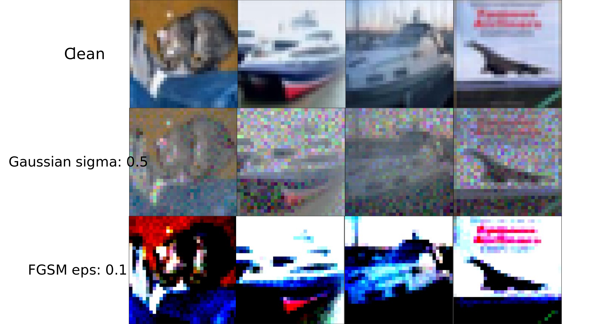
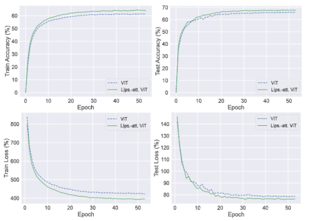

# adversarial-learning

*Deep neural network(DNNs) are vulnerable to perturbations on images[1]. Despite the high performance on clean datasets, we need to consider this shortcoming when deploying to real applications. This is the code I experimented with in adversarial learning.*

## Usage

### clone

```bash
git clone https://github.com/1zeryu/adversarial-learning.git
```

### Requirements

```bash
pip install requirements.txt
```

### Run

You can understand some arguments in advance:

```bash
python main.py -h
```

## Code Structure

Here is the structure of my project. Adversarial directory is my code of adversarial method. "networks" directory is my code of DNNs model. 
<details>
<summary>Expand to view</summary>
<pre><code>
adversarial-learning
├─adversarial 
├─checkpoints
├─csv
├─Dataset
├─example
├─logs
├─myutils
├─networks
├─runs
│  .gitignore
│  calclate.py
│  demo.ipynb
│  export.py
│  LICENSE
│  main.py
│  main.sh
│  README.md
│  requirements.txt
</code></pre>
</details>

You can get the model-related code details in the **networks** repository. Directory **runs**, **logs** store log files. 

The **myutils** directory is a directory of some tool files.  

Other directories and files are some assist code for our experiments.

## Backbone

* **ResNet and Wide-Resnet**[4] [5]
* **ViT**[6]

## Attacks

* **Gaussian** 

* **FGSM**

Fast Gradient Sign Method(FGSM), based on the rational hypothesis that DNNs is sufficiently linear in nature, add one-order noise at a time to increase the loss. 
$$
x^{\prime}=x+\varepsilon \cdot \operatorname{sign}(\nabla_x J(x, y))
$$


* **PGD**

 PGD, Project Gradient Descent, which can be seen as a replica of FSGM, is the iterative gradient attack method. PGD seek superb direction of attack by iterative without the linear hypothesis of FGSM.
$$
x_{t + 1}=\prod_{x + S}\left(x_t+\alpha \cdot \operatorname{sign}(\nabla_x J\left(x_t, y\right)\right))
$$


## 

## Lipschitz Defense

We use Lipschitz constraint in our model. 

### Parseval

We use Parseval networks[3] as defended networks to investigate whether Lipschitz constraints can improve the robustness of traditional CNNs and MLP model. Parseval networks incorporate Orthonormality constraints of weight matrics and Convexity constraints in aggregation layers to constraint the Lipschitz Constant of global networks. 

### L2 self-attention

It has demonstrated that Dot-product self-attention does not satisfy the Lipschitz continuous by deriving the derivative of Dot-product self-attention[8].  One solution is to use the L2 self-attention which is Lipschitz continuous. we can know that L2 multi-head attention is Lipschitz. 

## Result Curve



Experimental data graph with the comparison between ViT and Lipschitz attention ViT which use L2 self-attention. The metrics of the experiment include train accuracy, test accuracy, train loss, test loss in each epoch. It can be seen that Lipschitz attention ViT has higher accuracy and lower loss than vanilla ViT during the testing and training.

## Reference

[1] Szegedy C, Zaremba W, Sutskever I, et al. Intriguing properties of neural networks[J]. arXiv preprint arXiv:1312.6199, 2013

[2] Simon-Gabriel C J, Ollivier Y, Bottou L, et al. First-order adversarial vulnerability of neural networks and input dimension[C]//International Conference on Machine Learning. PMLR, 2019: 5809-5817

[3] Cisse M, Bojanowski P, Grave E, et al. Parseval networks: Improving robustness to adversarial examples[C]//International Conference on Machine Learning. PMLR, 2017: 854-863

[4] Zagoruyko S, Komodakis N. Wide residual networks[J]. arXiv preprint arXiv:1605.07146, 2016. 

[5] He K, Zhang X, Ren S, et al. Deep residual learning for image recognition[C]//Proceedings of the IEEE conference on computer vision and pattern recognition. 2016: 770-778. 

[6] Dosovitskiy A, Beyer L, Kolesnikov A, et al. An image is worth 16x16 words: Transformers for image recognition at scale[J]. arXiv preprint arXiv:2010.11929, 2020. 

[7] Goodfellow I J, Shlens J, Szegedy C. Explaining and harnessing adversarial examples[J]. arXiv preprint arXiv:1412.6572, 2014. 

[8] Kim H, Papamakarios G, Mnih A. The lipschitz constant of self-attention[C]//International Conference on Machine Learning. PMLR, 2021: 5562-5571. 